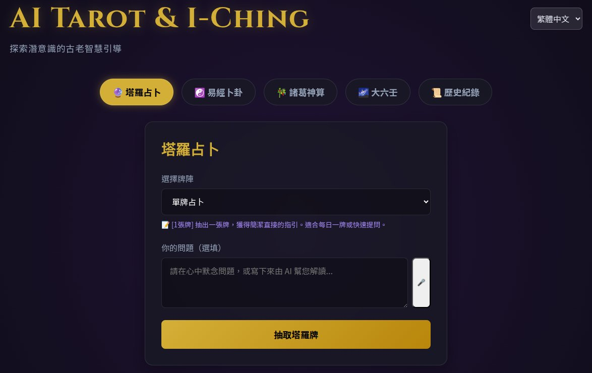
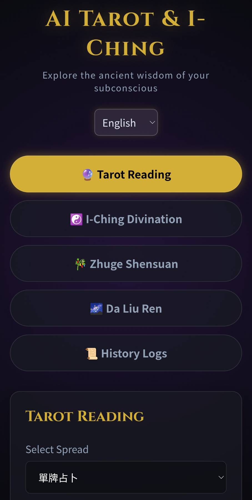
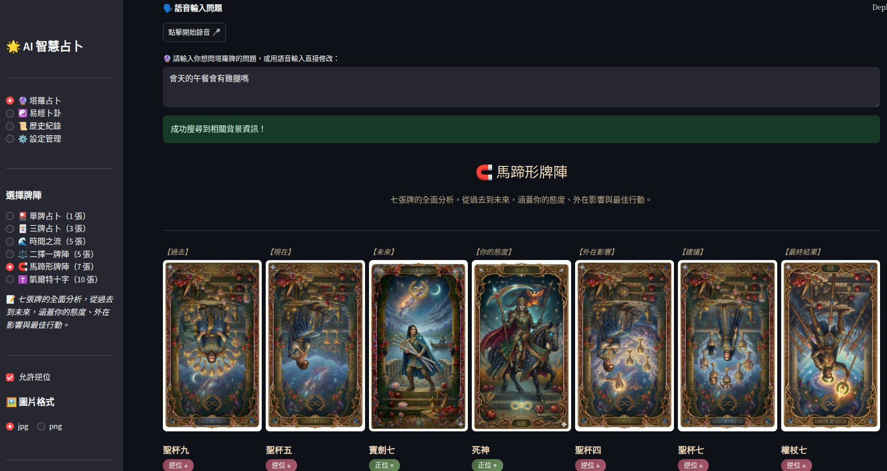
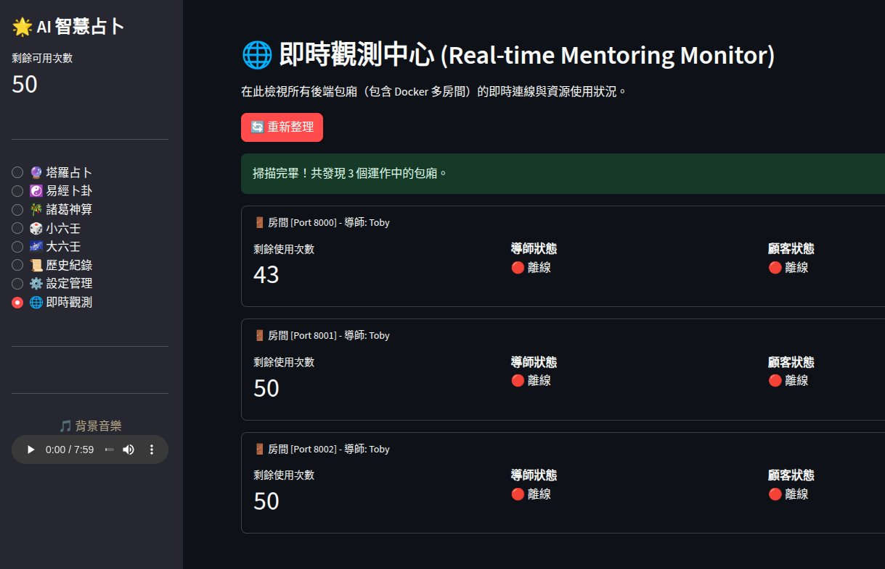
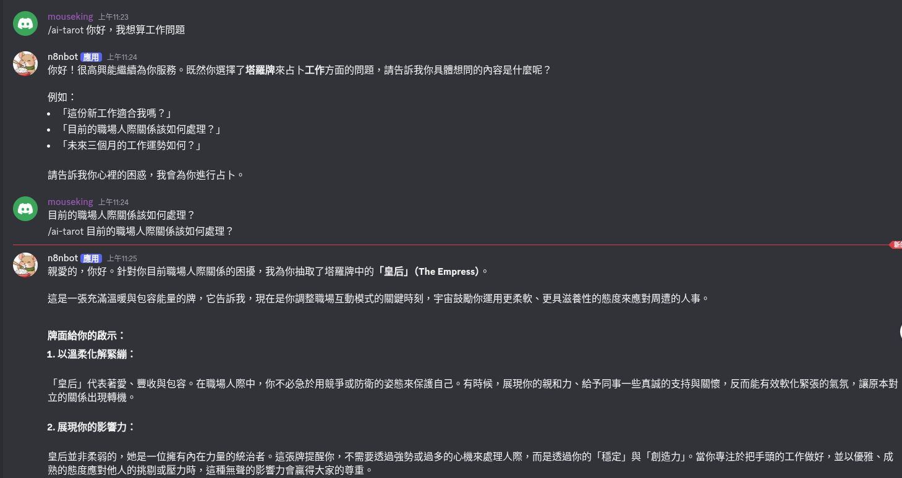

# 🔮 AI Tarot & ☯️ I-Ching

[English](README.md) | [繁體中文](README_zh.md)

AI 驅動的塔羅牌與易經卜卦 Web 應用，提供直覺的占卜體驗與專業的管理後台。

### 🌟 一般使用者占卜介面 (Vite 前端)
<p align="center">
  
  
</p>

### ⚙️ 專業解讀與測試管理 (Streamlit 介面)
### ⚙️ 專業解讀與測試管理 (Streamlit 介面)
<p align="center">
  
</p>
<p align="center">
  
</p>

### 💬 聊天機器人整合 (n8n AI Agent)
<p align="center">
  
</p>

## 功能特色

- 💬 **多平台對話機器人**：透過 n8n Advanced AI 建立無狀態 (Stateless) API 介接，完美支援 Line / Discord / Openclaw 對話。
- 🔮 **塔羅占卜**：完整 78 張塔羅牌、6 種經典牌陣、正逆位支援、詳細牌意。
- ☯️ **易經卜卦**：模擬傳統金錢六爻卜卦，自動呈現本卦、變卦及動爻指示。
- 🎋 **諸葛神算**：提供 384 籤傳統詩文與解意，結合 AI 進行白話精準解析。
- 🎲 **小六壬**：基於傳統數字論斷初、中、終三傳，提供快速直覺的每日吉凶指引。
- 🌌 **大六壬**：基於時辰起課，提供三傳四課的簡易排盤與格局，讓 AI 根據時空能量為您解讀吉凶。
- 🗣️ **語音輸入與非同步 TTS**：支援麥克風語音轉文字辨識，並可於輸入框手動微調。現已全面非同步化並整合高品質 edge-tts，徹底解決 Event Loop 衝突。
- 🔍 **Tavily 外部時事搜尋**：自動從網路搜尋最新話題/時事背景（由 Gemma 3 整理摘要）。
- 🤖 **Gemini AI 深度解析**：結合牌陣/卦象與外部時事，透過最新 Gemini 3.1 Flash/Pro 引擎做深入推演。
- 💾 **統一歷史紀錄與專屬過濾**：完整紀錄解讀與語音狀態，支援依「客戶名稱」在 Streamlit 後台直接下拉篩選歷史，並具備 CLI 技能修復失敗紀錄。
- ⚡ **WebSocket 即時多用戶通訊**：導入 WebSocket 雙向即時連線，完美隔離並同步「導師 (Toby)」與「客戶端」的即時抽牌體驗，具備優化的斷線重連機制。
- 🛡️ **安全性強化**：導師帳號全面啟用 **Bcrypt** 密碼哈希加密，取代舊有的明文存儲，確保帳戶安全。
- ⚙️ **Hydra 動態設定管理**：透過 YAML 設定檔 (Customer1, Customer2) 隨時切換 AI 模型，並可由 Streamlit 後台一鍵自訂所有占卜系統（塔羅、易經、諸葛、大六壬）的專屬提示詞。
- 🎵 **背景音樂 (BGM)**：可於設定檔或管理介面無縫切換多種冥想背景音樂，增添占卜氛圍。
- 🎨 **自訂圖片格式**：支援 JPG/PNG 精美 AI 生成圖無縫切換。
- 🛡️ **維運管理與即時觀測 (監視器)**：支援 Docker Compose 一鍵部署獨立的「導師包廂」，並提供 Streamlit 介面的 **即時觀測中心**，可自動掃描並監控所有包廂的即時連線狀態、可用次數，也可一鍵強制踢除異常顧客。同步支援 **AI-Factory 全局身分庫**，讓導師的好友與聊天內容能跨專案共享。
- 📱 **PWA 行動端支援**：支援 Progressive Web App 定義，可在手機（Brave/Chrome）或電腦中點選「安裝」，享受無網址列、全螢幕的 Native App 體驗。
- 🚀 **FastAPI 與 AI Agent Skill**：獨立的後端 API 端點 (`/api/tarot/draw` 等) 與 AI 技能說明文檔，讓未來的 AI Agent 也能自由幫你呼叫占卜服務。

## 快速開始

目前專案採用 **前後端分離 (Monorepo)** 架構：
- `backend/` 包含 FastAPI 後端、AI 邏輯與 Streamlit 測試管理介面。
- `frontend/` 包含 Vite 打包的極致客製化 HTML/CSS/JS 前端。

### 1. 啟動後端 API 與管理介面

本專案支援 **雙環境** (uv / Conda)，未來開發建議優先使用高速的 `uv` 工具。

```bash
cd backend

# 【推薦】使用 uv 閃電安裝 (uv sync)
uv sync
source .venv/bin/activate
# (備用) 或使用傳統 Conda
# conda activate toby
# pip install -r requirements.txt

# 啟動 API 伺服器 (FastAPI)
python start.py api

# 啟動管理與測試介面 (Streamlit)
python start.py admin
```

### 2. 啟動華麗的 Vite 前端

請另外開一個終端機：

```bash
cd frontend
npm install
npm run dev
```
接著在瀏覽器打開 `http://localhost:5173` 即可體驗極致的占卜 UI。

### 3. 下載圖片資源

由於圖片檔案過大，請從以下來源下載圖片壓縮檔 `ai-tarot-images.zip`：
[👉 點此下載圖片資源 (Google Drive)](https://drive.google.com/file/d/1e0_HGeluSyamB-rykJzBZsJj6w8Nln09/view?usp=sharing)

下載後，將 `ai-tarot-images.zip` 放入專案的 `assets/` 資料夾，並解壓縮出 `images/` 目錄。
最終結構應為：
```
assets/
└── images/
    ├── tarot/
    └── iching/
```
若在沒有圖片的情況下啟動，UI 會自動以無圖片的圖文方塊替代顯示，不會報錯。

### 4. 環境變數設定

```bash
# 切換到 backend 目錄並複製環境變數範例檔
cd backend
cp .env.example .env

# 編輯 backend/.env 填入必要的 API Keys:
# GEMINI_API_KEY=your_gemini_key
# N8N_API_KEY=your_n8n_key (如果你有啟用聊天機器人)
```

## 🚀 部署與測試階段 (Deployment Stages)

專案目前劃分為三個環境階段，確保從開發到正式上線的穩定性。

### 1. 開發階段 (Local Dev)
- **目標**：快速迭代後端邏輯與前端 UI。
- **後端**：
  ```bash
  cd backend && python start.py api
  ```
- **前端**：
  ```bash
  cd frontend && npm install && npm run dev
  ```
- **存取點**：`http://localhost:5173`

### 2. 預行階段 (Firebase Hosting Channel)
- **目標**：驗證遠端連線與手機端存取，使用臨時 URL 也不會影響正式站。
- **後端 (ngrok)**：
  ```bash
  # 自動開啟隧道並同步更新 .env.staging
  uv run python share_ngrok.py
  ```
- **前端 (Firebase Channel)**：
  ```bash
  cd frontend
  npm run build:stg
  firebase hosting:channel:deploy staging
  ```
- **存取點**：Firebase 提供之臨時網址 (例如 `ai-factory-tarot--staging-xxx.web.app`)。

### 3. 生產隔離測試 (Docker + Tunnel)
- **目標**：完整的容器化驗證，符合「有限責任」插件架構。

#### 🚀 一鍵自动化部屬 (One-Line Deployment)
如果您已經安裝 `docker`, `python`, `npm` 與 `firebase-tools`，可以直接執行整合腳本：
```bash
./run.sh
```
該腳本會自動完成以下動作：
1. 檢查並清除 port 8001/8002 的占用。
2. 使用 `docker compose` 重建並啟動後端房間。
3. 執行 `catch_url.py` 自動同步隧道網址至前端環境變數。
4. 編譯前端正式版並部署至 Firebase。

#### 🛠️ 手動步驟
- **後端 (Docker)**：
  ```bash
  docker compose up -d --build
  python catch_url.py
  ```
- **前端 (Firebase Production)**：
  ```bash
  cd frontend && npm run build:prod && firebase deploy
  ```
- **存取點**：正式網域 `https://ai-factory-tarot.web.app` 或 Cloudflare 隧道網址 (前端 `main.js` 具備環境感知，會自動切換存取路徑)。

---

### 🐳 Docker 多房間管理 (Production Mode)
若要建立多個獨立的導師包廂：
```bash
docker compose up -d
```
這會啟動 `tarot-room-1` (port 8001) 與 `tarot-room-2` (port 8002)，各房間具備獨立的歷史紀錄與設定。

## 🧪 自動化測試 (Unit Testing)

本專案於 `backend/tests/` 提供了基於 `pytest` 的完整單元測試。涵蓋了以下核心模組：
- **WebSocket 通訊**：測試多連線隔離與「導師 (Toby) / 客戶」的獨立廣播機制。
- **動態設定 (ConfigManager)**：驗證 YAML 設定檔的讀寫與預設值備援。
- **歷史紀錄 (History API)**：驗證依據「客戶名稱」建立的歷史紀錄篩選機制。
- **AI 占卜解析引擎 (Interpreters)**：模擬並驗證即將傳入 Gemini 模型的推演 Prompt 架構是否正確載入系統設定。

**執行測試：**

```bash
cd backend
# 啟動虛擬環境 (或者您的 conda 環境)
source .venv/bin/activate
uv pip install pytest pytest-asyncio httpx
uv run pytest -v tests/
```

## 專案結構

```text
ai-tarot/
├── frontend/               # Vite 前端專案 (使用者介面)
│   ├── index.html          # 主頁面與多語系標籤
│   ├── src/main.js         # 前端核心邏輯與動態 UI
│   ├── public/             # 靜態公共資源
│   └── vite.config.js      # Vite 開發伺服器與 API 代理設定
├── backend/                # FastAPI / Streamlit 後端專案
│   ├── start.py            # 統一啟動入口
│   ├── app.py              # Streamlit 路由引擎 (主入口)
│   ├── api/                # FastAPI 路由與 schemas 定義
│   ├── core/               # 核心推演引擎 (塔羅、易經、AI解析、語音)
│   ├── config/             # Hydra 設定檔目錄 (default/customer YAML)
│   ├── assets/             # 塔羅/易經圖片資源與背景音樂
│   ├── data/               # 靜態定義庫 (JSON)
│   ├── history/            # 使用者占卜紀錄存放區
│   ├── tools/              # 錯誤修復與紀錄移轉腳本
│   └── ui/                 # Streamlit UI 專用元件
├── ai_notice/              # 開發指南與規範文檔
├── share_ngrok.py          # Ngrok 自動化外網分享腳本
├── .env.example            # 環境變數範例檔
└── README.md               # 專案總說明文件
```

## 圖片資源

牌面圖片放在 `assets/images/` 目錄下。詳見 [IMAGE_GUIDE.md](ai_notice/IMAGE_GUIDE.md) 了解檔名格式與生成提示詞。

## 致謝 (Credits)

本專案的完滿落成，特別感謝以下工具與團隊的強大支援：
- 🎵 **背景音樂 (Music)**：由 [Suno](https://suno.com/) AI 音樂平台生成。Suno 讓創作專屬氛圍的冥想音樂變得無比簡單，為占卜過程帶來絕佳的沉浸體驗。
- 🎨 **視覺圖像 (Images)**：牌面與卦象圖片是由強大的 [Nano Banana2](https://civitai.com/models/25995?modelVersionId=32988) 視覺基準模型生成，完美呈現了精妙的東方禪意與神祕學色彩。
- 💻 **協作工程師 (Programming)**：專案核心架構、API 整合與程式碼重構打磨，由 Google DeepMind 打造的 agentic AI 軟體工程師 **Antigravity** 共同協助開發完成。

<div align="right">
  <sub><i>💡 <a href="ai_notice/VISION_ARCHITECTURE.md">Sneak peek: The visionary blueprint of the AI Consultant Framework</a></i></sub>
</div>

## License

MIT

