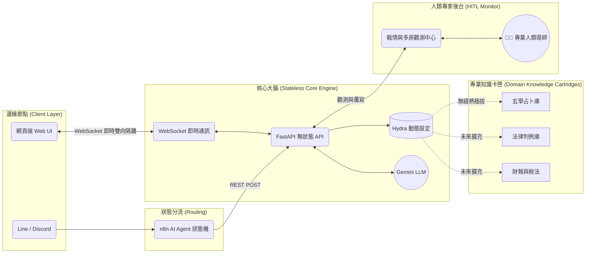

# 🚀 核心架構願景：通用型 Human-in-the-Loop AI 顧問引擎

> **「目前的『玄學占卜』只是這台超級主機上插著的第一塊知識卡匣。系統真正的底層價值，是一套可無限擴展的人機協作 (Human-in-the-Loop) 專家顧問 SaaS 框架。」**

## 1. 系統本質：超越單一領域的 SaaS 框架

雖然本專案 (`AI Tarot & I-Ching`) 初期聚焦於東方玄學與塔羅牌的占卜應用，但架構設計從第一天起，就將 **「領域知識 (Domain Knowledge)」**、**「推演邏輯 (Inference Engine)」**、**「即時互動介面 (WebSocket UI)」** 與 **「多渠道通訊 (n8n API)」** 完全抽離解耦。

這意味著，只要抽換後端的 YAML 設定檔與靜態資料結構，這套系統能瞬間無痛轉型為任何**高知識密集、且需要人類溫度**的專業顧問平台。

---

## 2. 系統架構圖解 (Architecture Blueprint)

---

## 3. 核心架構優勢 (Core Architectural Advantages)

### 🧩 知識掛載與推演解耦 (Decoupled Knowledge & Inference)
將 System Prompt、業務規則與靜態資料集 (JSON) 完全獨立於核心程式碼之外。透過 **Hydra** 的動態設定層，系統能在不重啟服務的情況下，無縫熱切換不同的「專家大腦」。

### 🤝 Human-in-the-Loop 雙向即時通訊 (HITL via WebSocket)
純 AI 客服容易產生幻覺，且極度缺乏「人類的溫度與信任感」。
本系統不追求全自動化，而是透過 **WebSocket 雙向隔離機制**實作「導師包廂 (Mentor Room)」：
1. **AI 負責做苦力**：處理繁瑣的跨庫資料檢索、法律比對與初步推理。
2. **專家負責給溫度**：人類導師在後台同步觀測 AI 的推演結果，並可視情況即時介入、修改或直接發言。這是如法律、醫療、心理諮商等「高信任門檻產業」最完美的落地防線。

### 🌐 無狀態 API 與多渠道分發 (Stateless API & Omnichannel)
後端的 **FastAPI** 被精煉為純粹的無狀態 (Stateless) 工具端點。而複雜的「對話上下文記憶」與「意圖判斷」，則交由 **n8n AI Agent** 等專職狀態機處理。這讓顧問服務不僅限於專屬網頁，能輕易將 AI 大腦掛載至企業內部 Teams、Slack 或公眾 Line 帳號，實現「服務無所不在」。

### 🛡️ 多租戶與資源隔離 (Multi-tenant Docker Deployment)
透過 **Docker Compose** 實現的「多房間 (Multi-Room) 部署」，為 B2B 商業模式奠定基礎。系統確保不同企業客戶、或不同顧問團隊的歷史資料庫與運算資源絕對隔離，完美保障商業機密。

---

## 4. 未來擴充藍圖：無限可能的「知識卡匣」

憑藉高度模組化的底層邏輯，未來只要置換 `Domain Cartridges`，即可平行擴展至以下高價值商業領域：

*   **⚖️ AI 輔助法律顧問 (AI Co-Counsel)**
    *   **知識卡匣**：六法全書、過往判例庫、合約範本。
    *   **協作模式**：客戶輸入初步案情，系統利用 RAG (檢索增強生成) 精準提取法條，AI 進行法理推演與風險抓漏。人類資深律師在 Streamlit 戰情中心快速審閱 AI 結論，微調後送出最終策略建議，大幅提升律師接案量。
*   **💼 企業財稅/合規顧問 (Financial & Compliance Advisor)**
    *   **知識卡匣**：企業財報數據、各國稅法規範、內控稽核守則。
    *   **協作模式**：業務端透過私有 Line 隨時查詢報價是否踩到合規紅線，AI 秒速比對條文。若遇極端特例，財務長能透過觀測中心「攔截」回答並親自接手對話。
*   **🧠 心理諮商輔助系統 (Psychological Counseling Aid)**
    *   **知識卡匣**：臨床心理學理論、諮商流派框架、情緒向量分析模型。
    *   **協作模式**：AI 扮演第一線的情緒傾聽者與紀錄梳理者。真正的諮商師在後台不僅能看到對話，更能看到 AI 即時標註的「情緒脈絡與防衛機制觸發點」，將心理諮商推進到極致的高效配合。

---

## 5. 下一步技術演進 (Technical Roadmap)

為了完美支援更具規模性的 B2B 專家系統，本框架的下一階段基礎建設將聚焦於三大核心主軸：

1.  **長期記憶與實體追蹤 (Long-Term Memory & Entity Tracking)**
    *   結合圖資料庫 (Graph Database) 實作針對單一客戶、或單一案件的「實體記憶庫」，讓 AI 顧問能像老朋友一樣記住跨越數月、數次會話的微小細節。
2.  **向量資料庫導入 (Vector Database & RAG Pipeline)**
    *   正式引入 **pgvector** 或 **ChromaDB** 等向量搜尋引擎，取代現行的靜態 JSON 載入，讓系統具備毫秒級檢索千萬字法律條文或企業級內部 PDF 檔案的能力。
3.  **多智能體協作 (Multi-Agent Orchestration)**
    *   讓後端不再是單一 LLM 負責全場。在複雜諮詢中，可拆分為「檢索 Agent」找法條、「推演 Agent」寫草稿、「審查 Agent」抓漏洞 (Red-teaming)，經過 Agent 內循環辯論後，再將最無懈可擊的草案呈報給人類專家做最終確認。